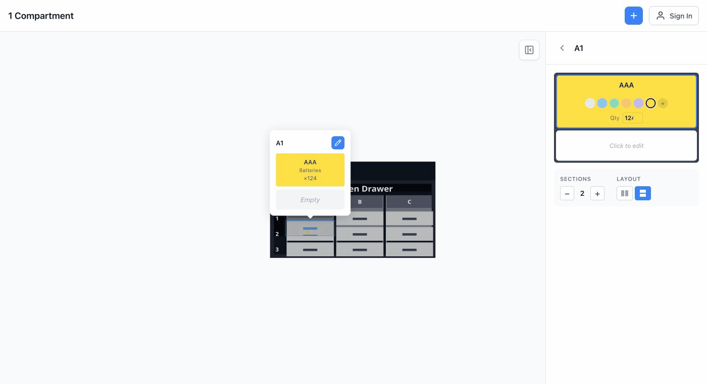
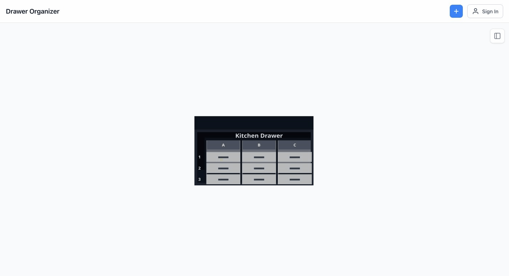

# Organizer

A collaborative 3D drawer organization app built with React, Three.js, and Cloudflare Workers.

## Why this exists

Started as internal tooling at almnds for organizing physical drawers and storage rooms. Open-sourced for others to use or self-host.

The interesting engineering problems: offline-first with real-time collaboration, role-based permissions across a shared data model, and a 3D interface that works on both desktop and mobile.

## Screenshots

| Desktop | Mobile |
|---------|--------|
|  |  |



## Architecture (high level)

```
┌───────────────────────────────────────────────────────────────────┐
│                          Browser App                              │
│  ┌─────────────┐  ┌───────────────┐  ┌─────────────────────────┐  │
│  │ React Three │  │ Zustand       │  │ Offline Queue           │  │
│  │ Fiber (3D)  │  │ (Local State) │  │ (localStorage persist)  │  │
│  └─────────────┘  └───────────────┘  └─────────────────────────┘  │
└───────────────────────────┬───────────────────▲───────────────────┘
                            │                   │
                   HTTP/REST│                   │WebSocket
                            │                   │
┌───────────────────────────▼───────────────────▼──────────────────┐
│                    Cloudflare Workers                            │
│  ┌─────────────────────────────┐  ┌───────────────────────────┐  │
│  │ Hono API Routes             │  │ Durable Object (RoomSync) │  │
│  │ - Auth (JWT + cookies)      │  │ - WebSocket connections   │  │
│  │ - CRUD operations           │  │ - Broadcast to room       │  │
│  │ - Permission checks         │  │ - User presence           │  │
│  └──────────────┬──────────────┘  └──────────────▲────────────┘  │
│                 │                                │               │
│                 │ write                          │ broadcast     │
│                 │                                │               │
│  ┌──────────────▼────────────────────────────────┴─────────────┐ │
│  │                     D1 (SQLite)                             │ │
│  │  users, rooms, room_members, drawers, compartments, etc.    │ │
│  └─────────────────────────────────────────────────────────────┘ │
└──────────────────────────────────────────────────────────────────┘
```

**Write path**: Client → REST API → D1 write → Durable Object broadcast → all connected clients

**Read path**: Initial load via REST API; subsequent updates via WebSocket events

### Backend abstraction

Storage and realtime are abstracted behind interfaces, making it possible to swap Cloudflare D1/Durable Objects for another backend:

```
api/src/
├── storage/
│   ├── interfaces/index.ts   # IUserRepository, IRoomRepository, etc.
│   ├── types.ts              # Shared types
│   └── d1/                   # D1 (SQLite) implementations
├── realtime/
│   └── interfaces.ts         # IRealtimeProvider, IRealtimeRoom
└── providers/
    ├── storage.ts            # IStorageProvider interface
    └── cloudflare.ts         # createStorageProvider(), createRealtimeProvider()
```

To use a different backend (Postgres, Supabase, etc.), implement the repository interfaces and create a new provider factory.

## Consistency model

- **Optimistic local updates**: UI updates immediately on user action, before server confirms
- **Server-authoritative commit**: All writes go through REST API which validates permissions and persists to D1
- **Broadcast for convergence**: After successful write, API calls Durable Object `/broadcast` to push event to all room connections
- **Last-write-wins**: Timestamp-based conflict resolution via `updatedAt`—older updates are silently skipped; no manual merge UI
- **Offline replay on reconnect**: Pending operations queue in localStorage, replay in timestamp order when connection restores

## Offline + conflicts

Mutations while offline are queued in `offlineStore` (Zustand + localStorage persistence):

1. Each operation stores: entity type, entity ID, operation type, data payload, timestamp
2. Operations for the same entity coalesce (latest data wins locally)
3. On reconnect: WebSocket reconnects first, then operations replay in timestamp order
4. Server compares `updatedAt` timestamp—older updates are skipped, newer updates apply
5. After 3 failed retries, operation is dropped with a toast notification (includes retry button)

No merge dialog—last-write-wins is acceptable for this use case.

## Data model (simplified)

- **users**: id, username, password_hash, display_name
- **rooms**: id, owner_id, name, is_default
- **room_members**: room_id, user_id, role (owner|editor|viewer), can_invite
- **room_invitations**: room_id, invitee_id, role, invited_by, can_invite
- **categories**: id, room_id, name, color_index, color (hex)
- **drawers**: id, room_id, name, rows, cols, grid_x, grid_y, compartment_width, compartment_height, display_order
- **compartments**: id, drawer_id, row, col, row_span, col_span, divider_orientation
- **sub_compartments**: id, compartment_id, display_order, relative_size, item_label, item_category_id, item_quantity

Compartments support merging via row_span/col_span. Sub-compartments are created by dividers within a compartment.

## Features

### 3D Visualization
Interactive 3D drawer grid using React Three Fiber. Click to select compartments, drag to pan/rotate camera. Drawers slide open when a compartment inside is selected.

### Compartment System
Grid-based compartments with horizontal or vertical dividers creating sub-compartments. Compartments can be merged (multi-cell spans) or split back to individual cells. Multi-select compartments to bulk-assign categories or merge multiple at once.

### Categories
Room-scoped categories with 12 preset colors or custom hex. Category colors display on items in both 3D view and inventory list.

### Search
Global search highlights matching compartments in 3D view. Navigate directly to search results.

### Rooms & Collaboration
- **Owner**: Full control—delete room, manage all members, grant invite permission
- **Editor**: Add/edit/delete drawers, compartments, items
- **Viewer**: Read-only access

The `can_invite` flag is separate from role—owners can grant any member the ability to invite others.

### Real-time Sync
Room-scoped WebSocket connections via Cloudflare Durable Objects. Server broadcasts after every write; clients apply updates to local state.

### Offline Support
Full offline functionality with queued mutations. Visual indicator shows pending operations and connection status.

### Mobile Experience
Bottom sheet UI with three snap points (collapsed/half/full). Gesture-based dragging with velocity detection. Long-press for multi-select rectangle selection.

## Tech Stack

### Frontend
- React 19 with React Compiler
- Three.js via React Three Fiber
- Zustand for state (localStorage persistence for offline)
- Vite + vite-plugin-pwa for PWA/service worker
- CSS Modules

### Backend
- Cloudflare Workers (edge deployment)
- Hono (routing + middleware)
- D1 (SQLite database)
- Durable Objects (WebSocket state)
- Turnstile (bot protection on auth)

## API Overview

### Auth
JWT access tokens (HTTP-only cookie, path `/api`, 15 min) + refresh tokens (HTTP-only cookie, path `/api/auth`). Turnstile verification on login/register.

### Rooms
CRUD + member management. Each user gets a default room on registration.

### Invitations
Invite by username. Invitees see pending invitations; can accept/decline. Separate `can_invite` permission from role.

### Drawers
CRUD within a room. Compartments auto-created on drawer creation based on rows × cols.

### Compartments
Update divider orientation/count. Merge multiple compartments into one (row_span/col_span). Split merged compartments back.

### Items
Update sub-compartment item data (label, category, quantity). Batch updates supported.

### Categories
Room-scoped CRUD. Color via preset index or custom hex.

### WebSocket
`/api/rooms/:roomId/ws` — authenticates via HTTP-only cookie (same as REST API).

Broadcasts: drawer/compartment/item CRUD events, user join/leave presence.

Reconnection: Exponential backoff with 45s max delay, retries indefinitely.

## Development

### Prerequisites
- Node.js 18+
- Wrangler CLI (`npm install -g wrangler`)

### Frontend

```bash
npm install
npm run dev
# Runs on http://localhost:5173
```

### Backend

```bash
cd api
npm install

# Apply migrations to local D1
wrangler d1 migrations apply DB --local

# Start dev server (creates local D1 automatically)
npm run dev
# Runs on http://localhost:8787
```

`DB` is the D1 binding name from `api/wrangler.jsonc`.

### Environment

**Frontend** (`.env` or `.env.local`):
```
VITE_API_URL=http://localhost:8787
VITE_TURNSTILE_SITE_KEY=1x00000000000000000000AA  # Test key
```

**Backend** (wrangler secrets for production, `.dev.vars` for local):
```
JWT_SECRET=your-secret-here
TURNSTILE_SECRET_KEY=1x0000000000000000000000000000000AA  # Test key
```

### Tests

```bash
# Frontend unit tests
npm run test:run

# Frontend unit tests with coverage
npm run test:coverage

# API tests
cd api && npm run test:run

# API tests with coverage
cd api && npm run test:coverage

# E2E tests
npm run test:e2e

# E2E tests with UI
npm run test:e2e:ui

# All coverage (unit + E2E)
npm run test:coverage:all
```

## Deployment

**Backend** (Cloudflare Workers):
```bash
cd api

# First time only: create remote D1 database
wrangler d1 create drawer-organizer

# Apply migrations to remote D1
wrangler d1 migrations apply DB --remote

# Set secrets
wrangler secret put JWT_SECRET
wrangler secret put TURNSTILE_SECRET_KEY

# Deploy
npm run deploy
```

**Frontend** (Cloudflare Pages):
Connect repo to Cloudflare Pages. Build command: `npm run build`. Output directory: `dist`.

## License

MIT
